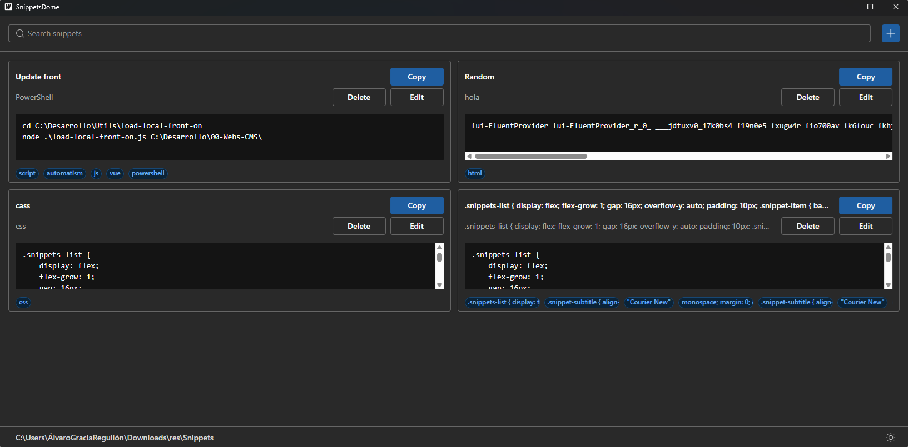
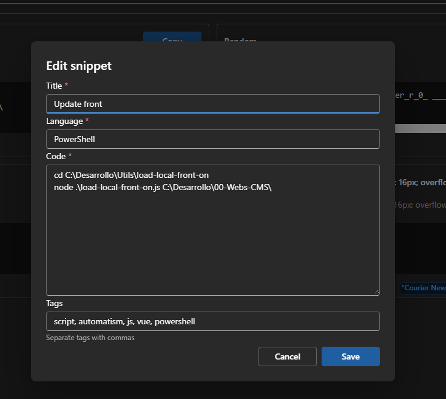
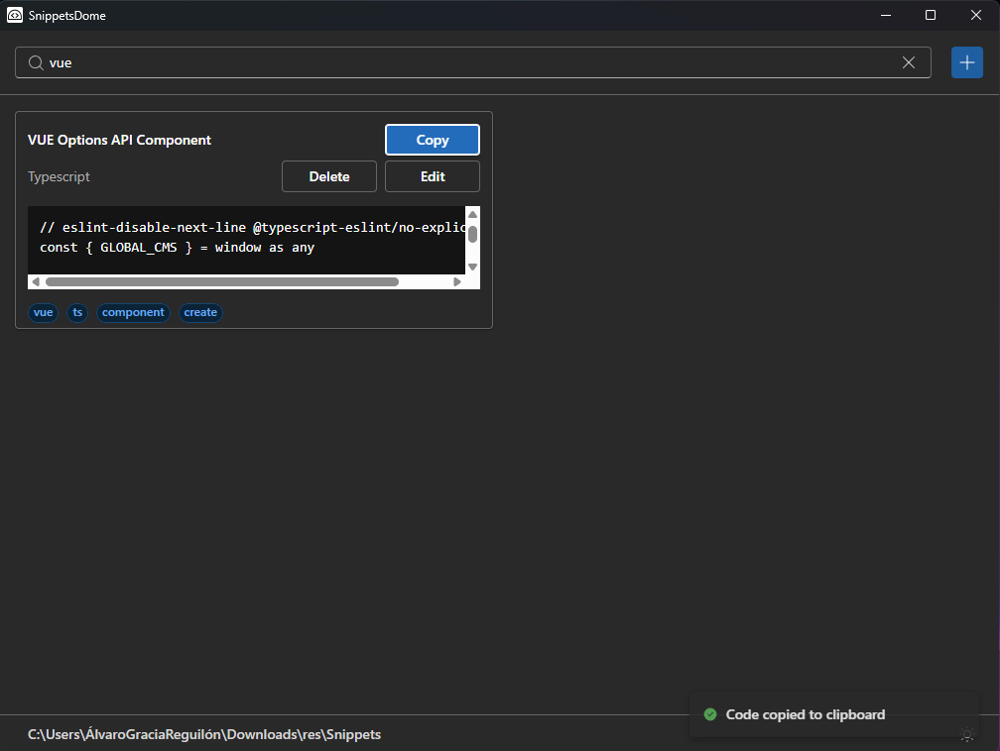

# Snippet Dome

A desktop application for saving, finding, and reusing code snippets without relying on an account or cloud service. It is built with Wails: Go handles the application logic and disk access, while React and TypeScript provide the user interface.

Snippets are stored in a user-selected JSON file, so data remains local and persists after the application is closed.

> A cross-platform desktop application built with Wails, Go, React, and TypeScript to manage code snippets locally with search, tags, and offline persistence.

<!-- TODO: -->
## Screenshots

Add the images under `docs/screenshots/` before publishing the project. The placeholders below identify the most useful screenshots; use PNG files, sample data, and avoid exposing personal paths.

### Main view

<!-- TODO: Add docs/screenshots/main-view.png: list with several snippets, search box, tags, actions, and storage footer. -->



The main screen brings together search, the create-snippet action, the results list, and the storage-folder and theme controls.

### Create or edit a snippet

<!-- TODO: Add docs/screenshots/snippet-editor.png: create/edit dialog with title, language, code, and tags. -->



### Search and copy

<!-- TODO: Add docs/screenshots/search-and-copy.png: an active search and the visual confirmation that code was copied. -->



## Features

- Create, edit, and delete snippets.
- Store a title, language, code block, and comma-separated tags.
- Case-insensitive search across titles, languages, tags, and code content.
- Copy code to the clipboard from each snippet.
- Confirmation before deletion and user-facing operation errors.
- Loading and empty-list states.
- Choose the data folder through the native folder picker.
- Store snippets in `snippets.json` inside the selected folder.
- Remember the selected folder across launches in the operating system configuration directory.
- Switch between light and dark themes.

## Technologies

- [Wails v2](https://wails.io/): desktop packaging and Go-to-frontend communication.
- [Go](https://go.dev/): domain, validation, services, and local persistence.
- [React](https://react.dev/) and [TypeScript](https://www.typescriptlang.org/): user interface.
- [Vite](https://vite.dev/): frontend development environment and build tool.
- [Fluent UI React v9](https://react.fluentui.dev/): accessible components, icons, and themes.
- JSON: a simple, portable storage format for the MVP.

## Architecture

There is no HTTP API or remote server. Wails generates bindings that allow React to call public methods on `App`, which delegate to Go application logic.

```text
React + TypeScript (frontend/src)
          │ generated Wails bindings
          ▼
app.go (application API)
          ▼
internal/service (use cases and validation)
          ▼
internal/repository (file reads and writes)
          ▼
local config.json + snippets.json
```

- `internal/domain/` defines the data handled by the application (`Snippet` and configuration).
- `internal/service/` generates identifiers and timestamps, validates title and code, and coordinates operations.
- `internal/repository/` isolates JSON handling and filesystem paths.
- `app.go` exposes `GetSnippets`, `CreateSnippet`, `UpdateSnippet`, `DeleteSnippet`, and folder selection to React.
- `frontend/wailsjs/` contains generated code: use it from the frontend, but do not edit it manually.

## Requirements

- Go (the required version is defined in [go.mod](go.mod)).
- Node.js and npm.
- [Wails CLI v2](https://wails.io/docs/gettingstarted/installation/).

On Ubuntu 24.04 or WSL, native Wails development also requires `build-essential`, `pkg-config`, `libgtk-3-dev`, and `libwebkit2gtk-4.1-dev`.

## Run in development mode

Install frontend dependencies the first time:

```bash
cd frontend
npm install
cd ..
```

Then start the application with hot reload:

```bash
wails dev
```

On Ubuntu 24.04 / WSL, use the matching WebKitGTK tag:

```bash
wails dev -tags webkit2_41
```

At first launch, select a folder using the button in the application footer. The app creates `snippets.json` in that folder. Cancelling the picker leaves the current folder unchanged.

## Build

First validate the frontend and backend:

```bash
cd frontend
npm run build
cd ..
go test ./...
```

Generate a distributable build with:

```bash
wails build
```

On Ubuntu 24.04 / WSL:

```bash
wails build -tags webkit2_41
```

Wails writes the generated binary to `build/bin/`. Its final format depends on the operating system used for the build.

## Local data

The application keeps configuration separate from snippet data:

| Data | Location | Contents |
| --- | --- | --- |
| Configuration | Operating system configuration directory, under `WailsSnippets/config.json` | Last selected folder. |
| Snippets | User-selected folder, in `snippets.json` | Snippet collection. |

Each snippet contains an identifier, title, language, code, tags, and creation date. The JSON file can be copied as a backup; close the application before editing it manually.

## Tests

The project includes focused Go tests for the service and JSON repositories, plus frontend tests with Vitest and Testing Library. The frontend suite covers search input behavior, rendering and actions in the snippets list (including copying), and tag normalization in the snippet editor.

Run the Go tests from the repository root:

```bash
go test ./...
```

Run the frontend suite from the `frontend` directory:

```bash
cd frontend
npm install
npm test
```

For interactive development, keep Vitest running in watch mode:

```bash
npm run test:watch
```

Before handing frontend changes over, also verify the production build:

```bash
npm run build
```

## Roadmap

The version 1.0 goal is to finish the visual polish, manually verify the full persistence cycle, and produce a distributable binary.

- [X] Implementation of tests on frontend.
- [ ] Polish layout, spacing, hover states, and code presentation.
- [ ] Add the screenshots referenced in this README.
- [X] Verify creation, editing, deletion, search, copying, and persistence after restarting.
- [ ] Generate and test at least one distributable binary.

After version 1.0, the plan includes:

- Full compatibility with macOS and Linux.
- Quick, combinable tag filters in a collapsible sidebar.
- Favorites, predictably sorted and accessible without opening the editor.
- System-tray integration for quick access to favorite snippets.
- JSON collections: create, open, close, and switch between several snippet files, with migration from the current `snippets.json` format.
- Syntax highlighting, a `Ctrl/Cmd + K` shortcut, import/export, SQLite, snippet-to-file export, and localization (en-es) once the MVP is stable.
- Configurable system command to save selected text as snippet. It will use a generic title to fill needs of model.
- Configurable system command by snippet to paste without interacting with aplication.

## License

No license has been defined for this repository yet.
