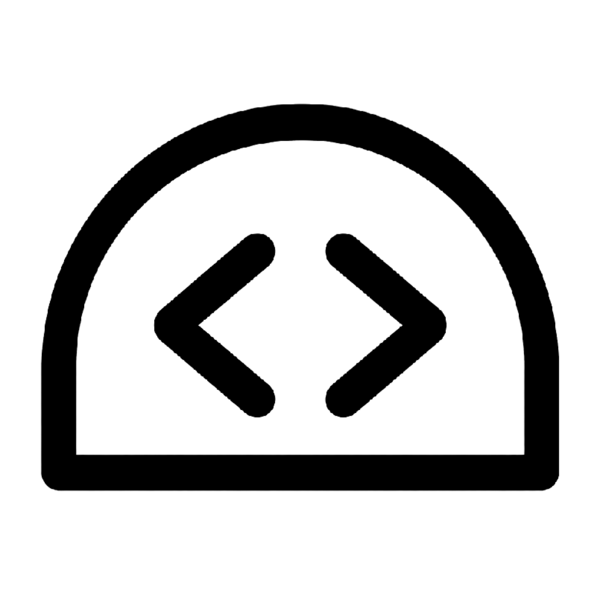

# Snippets Dome



A desktop application for saving, finding, and reusing code snippets without relying on an account or cloud service. It is built with Wails: Go handles the application logic and disk access, while React and TypeScript provide the user interface.

Snippets are stored in a user-selected JSON file, so data remains local and persists after the application is closed.

> A cross-platform desktop application built with Wails, Go, React, and TypeScript to manage code snippets locally with search, tags, and offline persistence.

## Screenshots

### Main view


The main screen brings together search, the create-snippet action, the results list, and the storage-file and theme controls.

### Create or edit a snippet


### Search and copy


## Features

- Create, edit, and delete snippets.
- Store a title, language, code block, and comma-separated tags.
- Case-insensitive search across titles, languages, tags, and code content.
- Copy code to the clipboard from each snippet.
- Confirmation before deletion and user-facing operation errors.
- Loading and empty-list states.
- Choose an existing JSON file or create a new one through the native file picker.
- Store snippets in the selected JSON file.
- Remember the selected file across launches in the operating system configuration directory.
- Switch between light and dark themes.
- Optional close-to-tray behavior on Windows, configured from the Settings dialog.
- Windows notification-area menu to open the app, copy one of five snippets, or quit completely.

## Technologies

- [Wails v2](https://wails.io/): desktop packaging and Go-to-frontend communication.
- [Go](https://go.dev/): domain, validation, services, and local persistence.
- [React](https://react.dev/) and [TypeScript](https://www.typescriptlang.org/): user interface.
- [Vite](https://vite.dev/): frontend development environment and build tool.
- [Fluent UI React v9](https://react.fluentui.dev/): accessible components, icons, and themes.
- JSON: a simple, portable storage format for the MVP.

## Architecture

There is no HTTP API or remote server. Wails generates bindings that allow React to call public methods on `App`, which delegate to Go application logic.

```text
React + TypeScript (frontend/src)
          │ generated Wails bindings
          ▼
app.go (application API)
          ▼
internal/service (use cases and validation)
          ▼
internal/repository (file reads and writes)
          ▼
local config.json + snippets.json
```

- `internal/domain/` defines the data handled by the application (`Snippet` and configuration).
- `internal/service/` generates identifiers and timestamps, validates title and code, and coordinates operations.
- `internal/repository/` isolates JSON handling and filesystem paths.
- `app.go` exposes `GetSnippets`, `CreateSnippet`, `UpdateSnippet`, `DeleteSnippet`, and file-selection bridges to React.
- `frontend/wailsjs/` contains generated code: use it from the frontend, but do not edit it manually.

## Requirements

- Go (the required version is defined in [go.mod](go.mod)).
- Node.js and npm.
- [Wails CLI v2](https://wails.io/docs/gettingstarted/installation/).

On Ubuntu 24.04 or WSL, native Wails development also requires `build-essential`, `pkg-config`, `libgtk-3-dev`, and `libwebkit2gtk-4.1-dev`.

## Run in development mode

Install frontend dependencies the first time:

```bash
cd frontend
npm install
cd ..
```

Then start the application with hot reload:

```bash
wails dev
```

On Ubuntu 24.04 / WSL, use the matching WebKitGTK tag:

```bash
wails dev -tags webkit2_41
```

At first launch, open the file control in the application footer. Choose an existing JSON file or create a new file with the desired name. Cancelling either picker leaves the current file unchanged.

## Build

First validate the frontend and backend:

```bash
cd frontend
npm run build
cd ..
go test ./...
```

Generate a distributable build with:

```bash
wails build
```

On Ubuntu 24.04 / WSL:

```bash
wails build -tags webkit2_41
```

Wails writes the generated binary to `build/bin/`. Its final format depends on the operating system used for the build.

## Local data

The application keeps configuration separate from snippet data:

| Data | Location | Contents |
| --- | --- | --- |
| Configuration | Operating system configuration directory, under `SnippetsDome/config.json` | Last selected file and application preferences. |
| Snippets | User-selected JSON file | Snippet collection. |

Each snippet contains an identifier, title, language, code, tags, and creation date. The JSON file can be copied as a backup; close the application before editing it manually.

## Tests

The project includes focused Go tests for the service and JSON repositories, plus frontend tests with Vitest and Testing Library. The frontend suite covers search input behavior, rendering and actions in the snippets list (including copying), and tag normalization in the snippet editor.

Run the Go tests from the repository root:

```bash
go test ./...
```

Run the frontend suite from the `frontend` directory:

```bash
cd frontend
npm install
npm test
```

For interactive development, keep Vitest running in watch mode:

```bash
npm run test:watch
```

Before handing frontend changes over, also verify the production build:

```bash
npm run build
```

## Changelog

### 1.1.0 (in progress)

- Replaced folder-based storage with a user-selected JSON file.
- Added a React-managed file flow to open an existing collection or create a new one with a chosen name.
- Persist the selected file path and migrate the previous folder setting to its `snippets.json` file.
- Added a Settings dialog and an optional Windows close-to-tray flow. The notification-area menu opens SnippetsDome, copies one of five snippets, or quits the application.
- (in progress) Add an option to start SnippetsDome automatically with the operating system.
- (in progress) Complete cross-platform support for Windows, macOS, and Linux, including equivalent system-tray behavior where available.

### 1.0.0

- Delivered the initial offline snippet manager with creation, editing, deletion, searching, copying, tags, and persisted local storage.
- Added focused Go and frontend test coverage, visual polish, screenshots, and a distributable desktop build.

## Roadmap

Version 1.0 is complete. The project is now evolving with additional features:

- [ ] Launch SnippetsDome automatically when the operating system starts.
- [ ] Full compatibility with macOS and Linux, including system-tray support where the desktop environment provides it.
- [ ] Quick, combinable tag filters in a collapsible sidebar.
- [ ] Favorites, predictably sorted and accessible without opening the editor.
- [X] Windows system-tray integration for quick access to five snippets.
- [X] Replace folders-based storage with files system, electing and creating JSON to manage different snippets lists if wanted.
- [ ] Syntax highlighting, a `Ctrl/Cmd + K` shortcut, import/export, SQLite, snippet-to-file export, and localization (en-es).
- [ ] Configurable system command to save selected text as a snippet with a generic title.
- [ ] Configurable command for pasting a snippet without interacting with the application.
- [ ] Priority system: assign a number to an asset that makes it appear 1st or last.

## License

No license has been defined for this repository yet.
